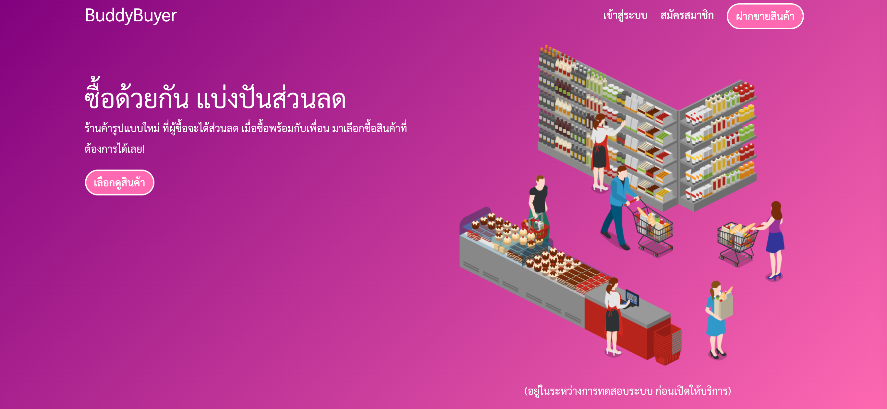
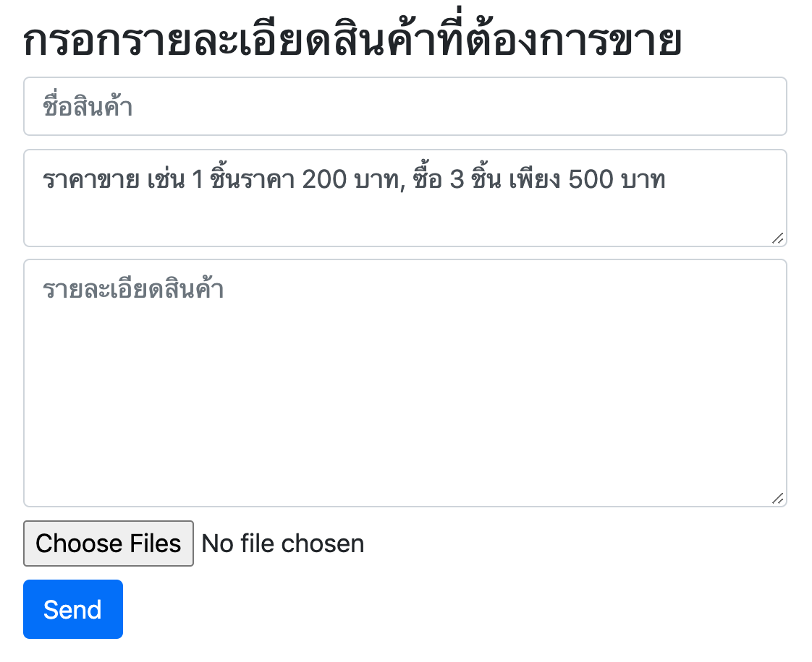

# BuddyBuyer's seller system


```
create database shop default charset 'utf8';
create user 'dayone' identified with mysql_native_password by 'oneday';
grant all on shop.* to dayone;
```

## Current Screen


## To Do
- Add seller's contact, phone number, LINE, Facebook Messenger ...
- Add SWOT of each product
- Add competitor of each product
